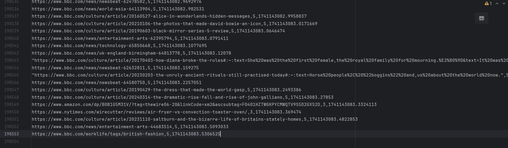

# web_url_scanner

## package installation

From the project root directory run

```bash
pip install .
```

## Run script
Input list of URLs are present in a `input.txt` file in a root directory. Each URL starts from newline.

The below command will start script execution. Need to run script from a root directory to properly read input.
```bash
python .\src\web_url_scanner\main.py
```

`data` folder will be created with 2 files: `BROKEN_URL_TIMESTAMP.csv` and `URL_TIMESTAMP.csv`


## Testing

I was able to get 19k records in `URL_TIMESTAMP.csv` file during 2 hours.


